### A08 - Fast Api with Covid Data
### VINEELA SEERLA
### Description:

Create a RESTful API using FastAPI that provides access to COVID-19 data.
The API will fetch the data from a publicly available data source and expose endpoints to retrieve various statistics related to COVID-19 cases.

### Files

|   #   | File                  | Description                                        |
| :---: | :-------------------- | -------------------------------------------------- |
|   1   | [api.py](api.py)      | Main driver of my project that launches game.      |
|   2   | [data.csv](data.csv)  | Helper class that holds movement functions         |

### Instructions

- Install libraries- unicorn, fastapi, rich.
- Run api.py file/ Use command: uvicorn api.app --reload 
- copy the URL(http://127.0.0.1:8000) and use browser to invoke.
- click on try it out on which endpoint you want to access
- Insert valid input parameters and execute.

### OUTPUT
BASE URL: http://127.0.0.1:8000

### Route: /deaths
Get the total number of deaths across all countries and regions.

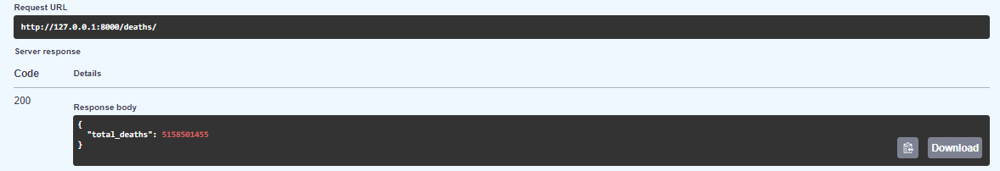

### Route: /deaths/{year}
Get the total number of deaths for the given year.

Parameters: year (str, optional): Filter by year.

Returns: total_deaths (int): Total number of deaths. year (str): Year of the data.

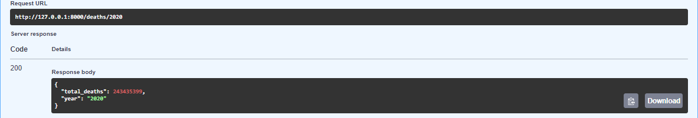

### Route: /avg_deaths/{year}
Get the average number of deaths per country for the given year.

Parameters: year (str, optional): Filter by year.

Returns: average_deaths (float): Average number of deaths per country. year (str): Year of the data.

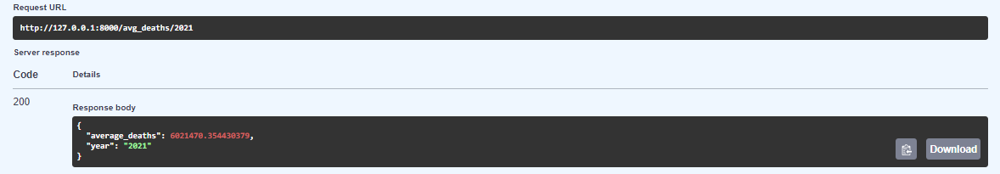

### Route: /deaths_by_country/{country}
Get the total number of deaths for the given country.

Parameters: country (str): Filter by country.

Returns: total_deaths (int): Total number of deaths. country (str): Name of the country.

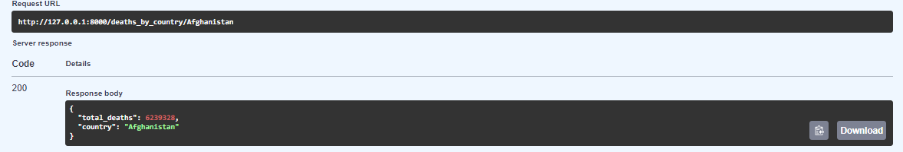

### Route: /deaths_by_region/{region}
Get the total number of deaths for the given region.

Parameters: region (str): Filter by region.

Returns: total_deaths (int): Total number of deaths. region (str): Name of the region.

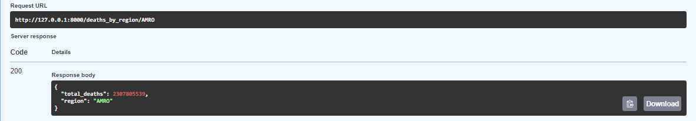

### Route: /deaths_by_country_yearn/{country}/{year}
Get the total number of deaths for the given country and year.

Parameters: country (str): Filter by country. year (str): Filter by year.

Returns: total_deaths (int): Total number of deaths. country (str): Name of the country. year (str): Year of the data.

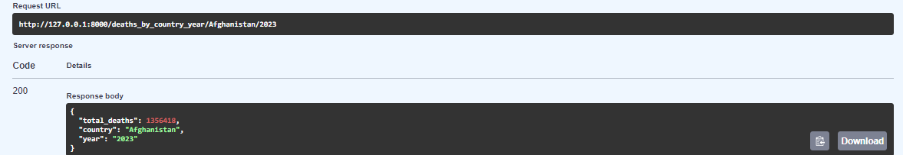

### Route: /deaths_by_country_yearn/{region}/{year}
Get the total number of deaths for the given region and year.

Parameters: region (str): Filter by region. year (str): Filter by year.

Returns: total_deaths (int): Total number of deaths. region (str): Name of the region. year (str): Year of the data.

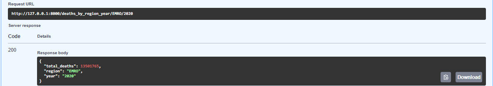

### Route: /cases
Get the total number of cases across all countries and regions.

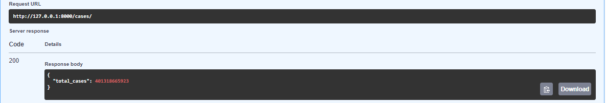

### Route: /cases/{year}
Get the total number of cases for the given year.

Parameters: year (str, optional): Filter by year.

Returns: total_cases (int): Total number of cases. year (str): Year of the data.

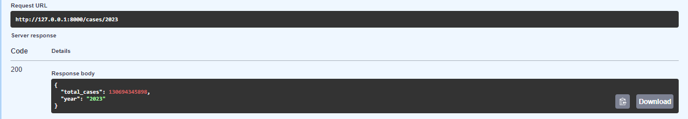

### Route: /avg_cases/{year}
Get the average number of cases per country for the given year.

Parameters: year (str, optional): Filter by year.

Returns: average_cases (float): Average number of casesper country. year (str): Year of the data.

### Route: /cases_by_country/{country}
Get the total number of cases for the given country.

Parameters: country (str): Filter by country.

Returns: total_cases (int): Total number of cases. country (str): Name of the country.

### Route: /cases_by_region/{region}
Get the total number of cases for the given region.

Parameters: region (str): Filter by region.

Returns: total_cases (int): Total number of cases. region (str): Name of the region.

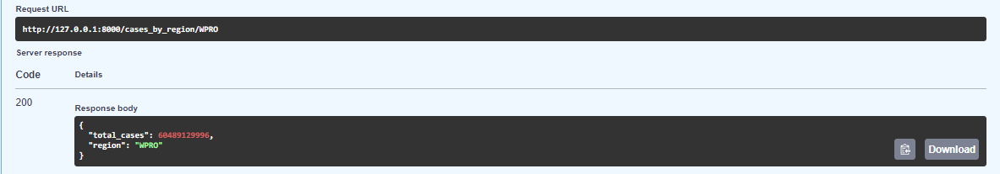

### Route: /cases_by_country_yearn/{country}/{year}
Get the total number of cases for the given country and year.

Parameters: country (str): Filter by country. year (str): Filter by year.

Returns: total_cases (int): Total number of cases. country (str): Name of the country. year (str): Year of the data.

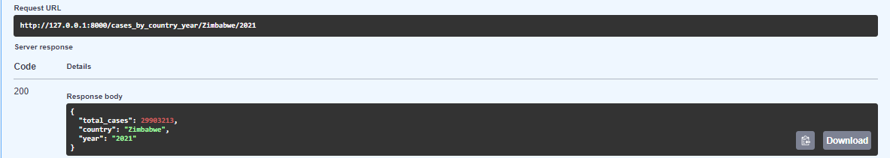

### Route: /cases_by_country_yearn/{region}/{year}
Get the total number of cases for the given region and year.

Parameters: region (str): Filter by region. year (str): Filter by year.

Returns: total_cases (int): Total number of cases. region (str): Name of the region. year (str): Year of the data.

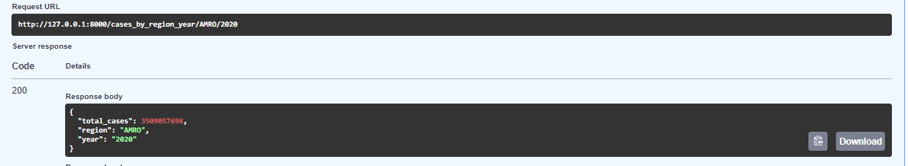

### Route: /min_deaths/
Get the country with the minimum number of deaths across all years.

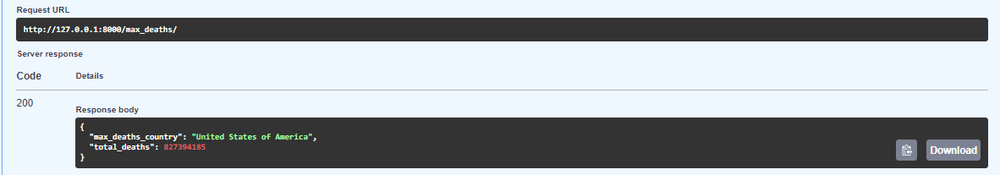

### Route: /max_deaths/
Get the country with the maximum number of deaths across all years.

### Route: /min_deaths/{min_date}/{max_date}
Get the country with the minimum number of deaths within the specified date range.

Parameters: min_date (str, optional): Minimum date for filtering. max_date (str, optional): Maximum date for filtering.

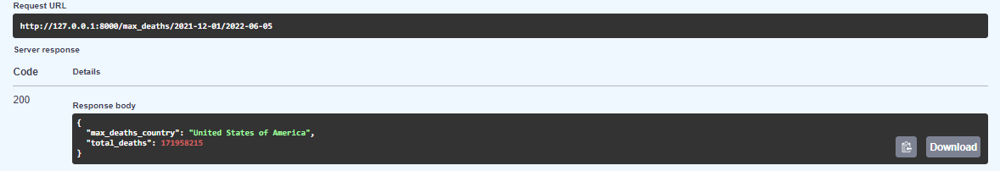

### Route: /max_deaths/{min_date}/{max_date}
Get the country with the maximum number of deaths within the specified date range.

Parameters: min_date (str, optional): Minimum date for filtering. max_date (str, optional): Maximum date for filtering.

### REPORT

- This document provides an overview of the API endpoints available in our project and their respective usage.
- Created separate endpoints for each route to retrieve details and cases based on the given dataset.
- The program now efficiently reads the parameters provided and uses them to extract the relevant data from the "data.csv" file.
- Allowing users to filter the data based on specific criteria, such as country, date range, or number of cases.
- Attached all output images for all endpoints with URL and specific response as per the given input parameters.
- The minor challenge faced in presenting the results for the min and max deaths route was overcome with the assistance of ChatGPT.
  
